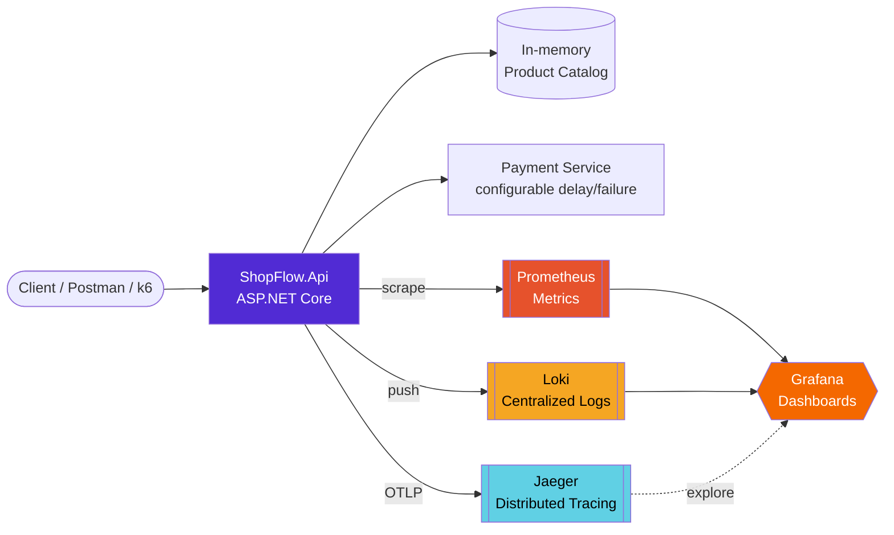

<div align="center">

#  ShopFlow Observability

### A production-like .NET microservice, fully instrumented — logs, metrics & traces, end to end.

<p>
  
  
  
  
</p>

<p>
  
  
  
</p>

**[Quick Start](#-quick-start) · [Architecture](#-architecture) · [Dashboards](#-dashboards--uis) · [Incident Demo](#-trigger-a-production-incident) · [Detailed Guide](DETAILED-GUIDE.md)**

</div>

---

## 🎯 What is this?

`ShopFlow` is a tiny e-commerce API (products + orders) wired up with a **full observability stack** — the kind you'd actually run in production, not a toy demo. Every request is traced, every business event is measured, every log line is searchable and correlated back to its trace.

It exists to answer one question, live:

> **"The API is slow." — okay, but *why*, and *where*?**

Flip one environment variable, and the Payment dependency turns into a slow, occasionally-failing service — instantly turning this from a demo into a real **Production Incident** you investigate with your own eyes across Grafana, Prometheus, Jaeger, and Loki.

---

## 🧩 Architecture



---

## 🧠 The Three Pillars, actually implemented

| Pillar | Tool | What you'll see |
|:--|:--|:--|
| 📝 **Logs** | Serilog → Loki | Structured, correlated logs with `TraceId`, queryable via LogQL inside Grafana |
| 📊 **Metrics** | OpenTelemetry → Prometheus | Request rate, P95/P99 latency, custom business counters (`orders.created`) |
| 🔍 **Traces** | OpenTelemetry → Jaeger | Full waterfall per order: `Validate → GetProduct → CheckInventory → Payment → SaveOrder` |

---

## 🛠️ Tech Stack

<table>
<tr>
<td valign="top" width="50%">

**API**
- ASP.NET Core 8 (Minimal APIs)
- Serilog (structured logging)
- OpenTelemetry SDK (traces + metrics)

</td>
<td valign="top" width="50%">

**Observability Backend**
- Jaeger — distributed tracing UI
- Prometheus — metrics storage
- Grafana — dashboards, pre-provisioned
- Loki — centralized log aggregation

</td>
</tr>
<tr>
<td valign="top">

**Load & Testing**
- k6 — scripted load testing
- Postman — ready-made collection

</td>
<td valign="top">

**Orchestration**
- Docker Compose — one command, five services

</td>
</tr>
</table>

---

## 🚀 Quick Start

```bash
git clone https://github.com/abdulrahman11a/OrderFlow-Observability.git
cd OrderFlow-Observability
docker compose up --build
```

That's it. Five containers spin up — API, Jaeger, Prometheus, Grafana, and Loki — all wired together.

| Service | URL | Notes |
|:--|:--|:--|
| 🌐 API | http://localhost:5000 | `/api/products`, `/api/orders`, `/health`, `/metrics` |
| 📈 Grafana | http://localhost:3000 | `admin` / `admin` — dashboard pre-loaded |
| 🎯 Jaeger | http://localhost:16686 | Service = `ShopFlow.Api` |
| 🔥 Prometheus | http://localhost:9090 | Raw metric queries |
| 📚 Loki | http://localhost:3100 | Queried via Grafana Explore |

---

## 📡 API Endpoints

| Method | Endpoint | Description |
|:--|:--|:--|
| `GET` | `/api/products` | List all products |
| `GET` | `/api/products/{id}` | Get a single product |
| `POST` | `/api/orders` | Create an order (validates → checks stock → charges → saves) |
| `GET` | `/health` | Liveness/readiness check |
| `GET` | `/metrics` | Prometheus scrape endpoint |

A ready-to-import Postman collection is included: [`ShopFlow.postman_collection.json`](ShopFlow.postman_collection.json)

---

## 📊 Dashboards & UIs

Once traffic hits the API (via Postman, curl, or `k6 run load-test.js`), open:

- **Grafana → Dashboards → `ShopFlow Overview`** — Request rate, P95 latency, orders/sec, payment duration
- **Grafana → Explore → Loki** → `{app="ShopFlow.Api"}` — every log, correlated with its `TraceId`
- **Jaeger → Find Traces** (Service: `ShopFlow.Api`) — the full waterfall per order

---

## 🔥 Trigger a Production Incident

This is the whole point. In `docker-compose.yml`, flip the `api` service's environment:

```yaml
- SHOPFLOW_PAYMENT_DELAY_MS=2500   # every payment call now takes 2.5s
- SHOPFLOW_PAYMENT_FAIL_RATE=0.2   # 20% of payments start failing
```

```bash
docker compose up -d --build api
k6 run load-test.js
```

Then investigate it exactly like you would in production:

1. **Grafana** — P95/P99 spike, error rate climbs. *Something* is wrong.
2. **Jaeger** — the slow span is unmistakably `PaymentService.Charge`. *Where* it's wrong.
3. **Loki** — logs for the same `TraceId` show `Payment declined` or a huge `ElapsedMs`. *Confirmation.*

That's `Monitoring → Observability → Root Cause`, live, in three tools.

---

## 📁 Project Structure

```
ShopFlow.Api/
├── Program.cs                 # Serilog + OpenTelemetry wiring, endpoints
├── Models/Models.cs
├── Services/
│   ├── ProductService.cs      # in-memory catalog
│   ├── PaymentService.cs      # the dependency you turn into an incident
│   └── OrderService.cs        # Validate → GetProduct → CheckInventory → Payment → Save
└── Telemetry/ShopFlowTelemetry.cs   # shared ActivitySource + Meter

grafana/
├── provisioning/               # auto-wired datasources + dashboard provider
└── dashboards/shopflow-overview.json

docker-compose.yml
prometheus.yml
loki-config.yml
load-test.js
ShopFlow.postman_collection.json
```

📖 Want a line-by-line walkthrough of every file? → **[DETAILED-GUIDE.md](DETAILED-GUIDE.md)**

---

<div align="center">

Built as a hands-on Observability lab — because reading about the three pillars isn't the same as watching a real incident unfold across your own dashboards.

</div>
